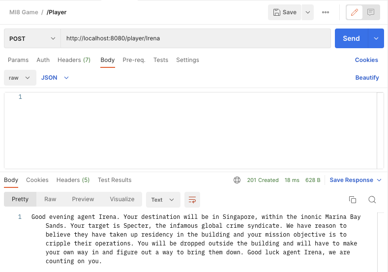
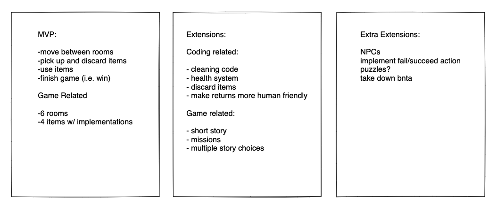
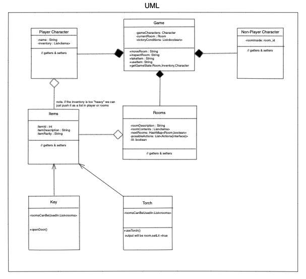
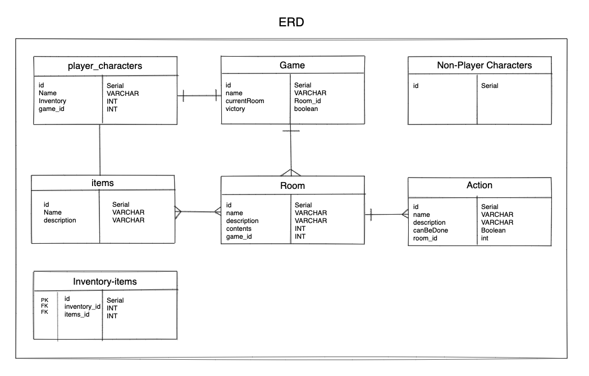
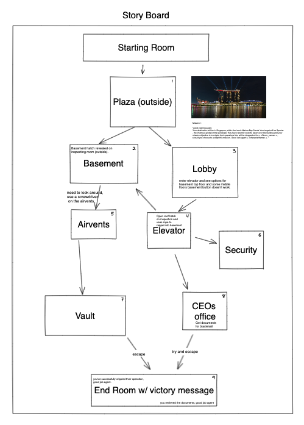

## Overview


MI8 Text-Based Adventure Game


Welcome to the MI8 group project. Our text based adventure will take you through a dangerous mission with a single objective: To take down an international crime syndicate.
The player takes on the role of a spy trying to infiltrate a high-security building. The goal is to navigate through various rooms in the building, collect items, and use them to solve problems and progress to the next level.
Using our skills learnt during the first 5 weeks of our bootcamp our API will have a series of HTTP requests to help you navigate this dangerous mission, whilst showcasing our understanding of APIs. 

### Contents

  - [Overview](#overview)
  - [The Challenge](#the-challenge)
  - [Screenshots](#screenshots)
  - [Game Structure](#game-structure)
  - [Setup](#setup)
  - [Our Process](#our-process)
  - [Game Requests](#game-requests)
  - [What we learned](#what-we-learned)
  - [Continued Development](#continued-development)
  - [Useful Resources](#useful-resources)
  - [Authors](#authors)
  - [Acknowledgments](#acknowledgments)

### The Challenge
Our MVP was to create a server-side, back-end project with the use of the following technologies/frameworks:


- Java
- Spring Boot
- An SQL database
- Maven 

With the use of Springboot we set out to create an API that would consolidate the knowledge we gathered and create a game. This game sets out to contain interconnected objects as well as bespoke methods which can affect the game-state.

### Screenshots



Above is the mission screen that is created as soon as you create a character.

### Game Structure
The game consists of various rooms in a building, and the player must navigate through them to progress. Some rooms contain items that can be collected and used to complete the mission. The player must use their wits and ingenuity to find the items and figure out how to use them to progress through the game.

### Setup
To run the game, you will need to have Java and MySQL installed on your computer. Follow the steps below to set up the game:

1. Clone the repository: git clone https://github.com/HelloMati/MI8.
2. Import the project into your preferred IDE (IntelliJ, etc.).
3. Create a MySQL database called mi8_api using createdDB mi8_api in the Terminal and update the application.properties file with your database details.
4. Run the project by running the MI8Application.java class.

### Our Process

Note: Our project underwent several changes as development went on, so the current diagrams are not representitive of the final product.

The initial process started with narrowing down the scope of our project to an achievable MVP in the 72 hours we had.



We established an MVP which we succesfully achieved as well as some extensions. Those extensions were discarding items and including a mission.



Our UML describes our thought process and the relationships we would want the classes to have with eachother.We initially started with an "inventory" concept which we then simplified into an "item" class.



Our EDR diagram was crucial to understanding how data would flow from each of our entities and revealed the necessity for a "inventory-items". This table would act as our join table, consisting of the primary keys found in "inventory" and "items".



Our storyboard was a crucial step in collaboration. It helped us get a top-down perspective on how our game would work, the end-states available and the accessibility between the various rooms we needed and the pre-requisites to pass each stage.

## Game Requests

There are several ways to reach the end of the game. Here is one way.

Endpoint requests using Postman:

To retrieve the current state of the game, use the following endpoint
request:
```
 Endpoint: /game
 Method: GET
 URL: http://localhost:8080/game 
```

To create a new player with the given name, use the following endpoint request:
```
Endpoint: /player
Method: POST
URL: http://localhost:8080/player/Max
```

To create a new game with the given ID, use the following endpoint request:
```
Endpoint: /game/gameid
Method: POST
URL: http://localhost:8080/game/1
```

To update the current room of a game with the given ID, use the following endpoint request:
```
Endpoint: /game/gameid/room
Method: PATCH
URL: http://localhost:8080/game/1/lobby
```

To update a player's item with the given name, use the following endpoint request:
```
Endpoint: /player/playerid/itemName
Method: PATCH
URL: http://localhost:8080/player/1/eyes
```

To update the current room of a game with the given ID, use the following endpoint request:
```
Endpoint: /game/gameid/room
Method: PATCH
URL: http://localhost:8080/game/1/elevator
```

To update a player's item with the given name, use the following endpoint request:
```
Endpoint: /player/playerid/itemName
Method: PATCH
URL: http://localhost:8080/player/1/eyes
```

To update the current room of a game with the given ID, use the following endpoint request:
```
Endpoint: /game/gameid/room
Method: PATCH
http://localhost:8080/game/1/security
```

To update a player's item with the given name, use the following endpoint request:
```
Endpoint: /player/playerid/itemName
Method: PATCH
URL: http://localhost:8080/player/1/eyes
```

To update the current room of a game with the given ID, use the following endpoint request:
```
Endpoint: /game/gameid/room
Method: PATCH
URL: http://localhost:8080/game/1/elevator
```

To update a player's item with the given name, use the following endpoint request:
```
Endpoint: /player/playerid/itemName
Method: PATCH
URL: http://localhost:8080/player/1/keycard
```

To update the current room of a game with the given ID, use the following endpoint request:
```
Endpoint: /game/gameid/room
Method: PATCH
URL: http://localhost:8080/game/1/ceosoffice
```

To update a player's item with the given name, use the following endpoint request:
```
Endpoint: /player/playerid/itemName
Method: PATCH
URL: http://localhost:8080/player/1/eyes
```

To update the current room of a game with the given ID, use the following endpoint request:
```
Endpoint: /game/gameid/room
Method: PATCH
URL: http://localhost:8080/game/1/extraction
```


This is the end of the game. 

## What we learned

Several challanges presented themselves when designing a text-based adventure game. One of them was the fact we did not have a front-end. We had to then use HTTP requests and JSON formatting to transmit our data that we wanted the user to interract with in their client.

```
public Player updateInventory(int playerId,String itemId,boolean addOrRemove){
    Player player = playerRepo.findById(playerId).orElse(null);
    Item item = itemRepo.findByName(itemId).orElse(null);
    if(item != null && player != null && addOrRemove){
        List<Item> inventory = player.getInventory();
        inventory.add(item);
        player.setInventory(inventory);
        playerRepo.save(player);
        return player;
    } else if (item != null && player != null && !addOrRemove) {
        List<Item> inventory = player.getInventory();
        inventory.remove(item);
        player.setInventory(inventory);
        playerRepo.save(player);
        return player;
    }
    return null;
}

This segment of code updates the inventory, we advanced the code to require an 'item' to access specific rooms as a method of progression across the rooms.
```

### Continued Development

Continued development would be the further implementations of our 'Extensions' and 'Extra-extensions' as stated in our intial diagram, besides our MVP.

### Useful Resources

[Excalidraw](https://excalidraw.com) - Collaboration tool.

[Hitman game mission introduction](https://www.youtube.com/watch?v=gU-i-ATBsN8) - Dialogue inspiration.

## Authors

- [James Emery](https://github.com/J-emery)
- [Forida Matin](https://github.com/HelloMati)
- [Wilson Sanches](https://github.com/W-Sanches94)

## Acknowledgments

We would like to extend our thanks to our tutors at BNTA for their time and dedication.